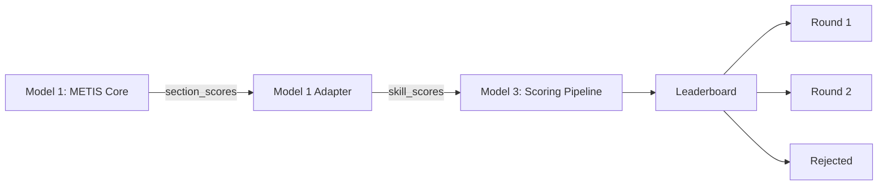

# METIS Model 3 - Walkthrough

## What Was Built

**Model 3: LangGraph-Based Scoring & Leaderboard System** - Combines outputs from Model 1 (METIS Core) and Model 2 to produce candidate rankings and shortlist decisions.

---

## Model 1 Integration ✅

Successfully integrated Model 1 (METIS Core) evaluations from the hackathon folder:

| Candidate | M1 Overall | M3 Final Score | Status |
|-----------|------------|----------------|--------|
| Ansh | 52 | ~54.0 | Rejected |
| Candidate Eval | 54 | ~55.7 | Rejected |
| Test Candidate | - | ~52.3 | Rejected |
| Tirth Bhanderi | - | ~51.5 | Rejected |

**Note**: Actual shortlisting depends on the cohort - with more high-scoring candidates, the percentile thresholds would shortlist more.

---

## Architecture



---

## Files Created

| File | Purpose |
|------|---------|
| `scoring_model/model1_adapter.py` | **NEW** - Converts METIS Core output to Model 3 format |
| `scoring_model/langgraph_model.py` | Main LangGraph workflow (v1.0.8) |
| `scoring_model/nodes/*.py` | Weighted Score, Integrity Check, Final Score, Shortlist |
| `scoring_model/groq_service.py` | Groq/LangChain AI integration |
| `routes/scoring.py` | Flask API routes including `/api/scoring/model1-eval` |
| `demo/leaderboard_demo.html` | Demo UI with "Load Model 1 Evaluations" button |
| `test_model1_integration.py` | Integration test script |

---

## API Endpoints

| Endpoint | Description |
|----------|-------------|
| `GET /api/scoring/model1-eval` | **NEW** - Load hackathon evaluations into Model 3 |
| `POST /api/scoring/model3` | Run Model 3 with custom Model 1 & 2 outputs |
| `GET /api/scoring/demo` | Run with demo data |

---

## Running the Demo

```bash
cd c:\Metis
pip install langgraph langchain langchain-groq flask flask-cors
python app.py

# Open http://localhost:5000/
# Click "Load Model 1 Evaluations" to see hackathon candidates
```

---

## Integration Flow

```python
# Model 1 adapter converts METIS Core output:
from scoring_model.model1_adapter import integrate_with_model3

result = integrate_with_model3('hackathon/hackathon/evaluations')
# Returns leaderboard with all candidates scored
```

---

## Scoring Formula

```
Final Score = Weighted Score × (Integrity Score / 100)
            = Σ(section_score × weight) × consistency_factor
```

Model 1's section_scores are mapped to skills:
- `skill_evidence` (30 pts) → Technical Skills
- `project_authenticity` (25 pts) → Project Quality
- `professional_signals` (15 pts) → Professional Experience
- `impact_outcomes` (15 pts) → Impact & Outcomes
- `resume_integrity` (15 pts) → Resume Quality
