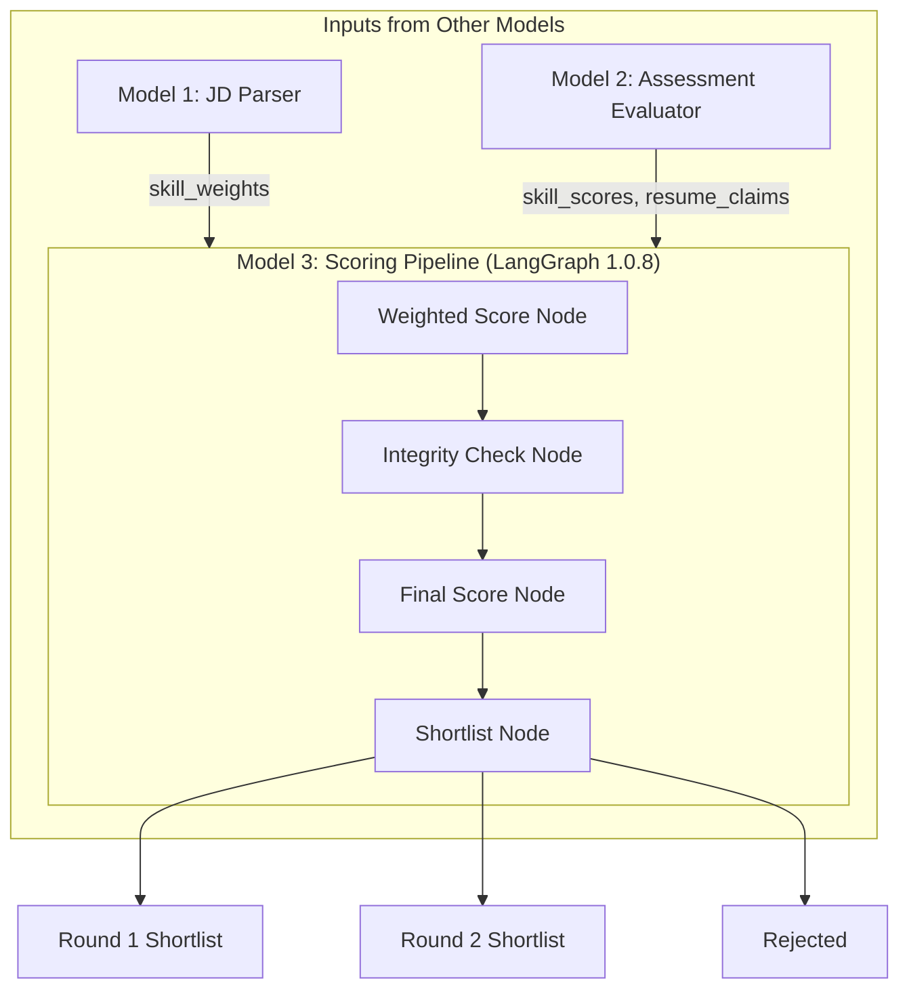

# METIS Model 3 - Walkthrough

## What Was Built

**Model 3: LangGraph-Based Scoring & Leaderboard System** - The third component of the METIS recruitment platform that combines outputs from Model 1 (JD Parser) and Model 2 (Assessment Evaluator) to produce final candidate rankings and shortlist decisions.

---

## Architecture



---

## Scoring Formula

| Component | Formula | Description |
|-----------|---------|-------------|
| **Weighted Score** | `Σ(score × weight)` | Sum of skill scores multiplied by JD weights |
| **Integrity Score** | `consistency(resume_claims, scores)` | 0-100 based on resume vs actual performance |
| **Final Score** | `Weighted Score × (Integrity Score / 100)` | Combined score with integrity penalty |

### Shortlisting Thresholds
- **Round 2**: Score ≥ 85 OR Top 10%
- **Round 1**: Score ≥ 70 OR Top 30%
- **Rejected**: Below thresholds

---

## Files Created

| File | Purpose |
|------|---------|
| `scoring_model/langgraph_model.py` | Main LangGraph workflow (v1.0.8) |
| `scoring_model/state.py` | State schema definitions |
| `scoring_model/nodes/weighted_score.py` | Σ(score × weight) calculation |
| `scoring_model/nodes/integrity_check.py` | Resume consistency checker |
| `scoring_model/nodes/final_score.py` | Final score calculation |
| `scoring_model/nodes/shortlist.py` | Round 1/2 shortlisting |
| `scoring_model/leaderboard.py` | Leaderboard service |
| `scoring_model/groq_service.py` | Groq/LangChain AI integration |
| `scoring_model/schema_validator.py` | Input validation for Model 1/2 |
| `scoring_model/sample_data.py` | Demo data generator |
| `routes/scoring.py` | Flask API routes |
| `demo/leaderboard_demo.html` | Demo UI page |
| `integration_example.py` | Model 1/2/3 integration example |

---

## API Endpoints

| Endpoint | Method | Description |
|----------|--------|-------------|
| `/api/scoring/model3` | POST | **Main integration** - accepts Model 1 & 2 outputs |
| `/api/scoring/demo` | GET | Run with demo data |
| `/api/scoring/generate` | GET | Generate random candidates |
| `/api/leaderboard/<job_id>` | GET | Get ranked leaderboard |
| `/api/shortlist/<job_id>/<round>` | GET | Get Round 1 or 2 shortlist |

---

## Data Format Required from Model 1 & Model 2

### Model 1 Output (JD Parser)
```python
{
    "job_id": "job_001",
    "job_title": "Senior Developer",
    "skill_weights": [
        {"skill": "Python", "weight": 0.25, "importance": 9},
        {"skill": "React", "weight": 0.20, "importance": 7}
    ]
}
```

### Model 2 Output (Assessment Evaluator)
```python
{
    "candidate_id": "cand_001",
    "candidate_name": "John Doe",
    "skill_scores": [
        {"skill": "Python", "score": 85},
        {"skill": "React", "score": 78}
    ],
    "resume_claims": [
        {"skill": "Python", "claimed_level": "Expert"},
        {"skill": "React", "claimed_level": "Advanced"}
    ]
}
```

Valid `claimed_level` values: `Expert`, `Advanced`, `Intermediate`, `Beginner`

---

## Running the Demo

```bash
# 1. Install dependencies
pip install langgraph langchain langchain-groq flask flask-cors

# 2. Start server
python app.py

# 3. Open in browser: http://localhost:5000/

# 4. Or run integration example
python integration_example.py
```

---

## Integration Example

```python
from scoring_model import run_model3_pipeline
from scoring_model.schema_validator import validate_for_model3

# Validate first
is_valid, report = validate_for_model3(model1_outputs, model2_outputs)

if is_valid:
    result = run_model3_pipeline(model1_outputs, model2_outputs)
    print(f"Round 2: {result['round_2_count']}")
    print(f"Round 1: {result['round_1_count']}")
```
